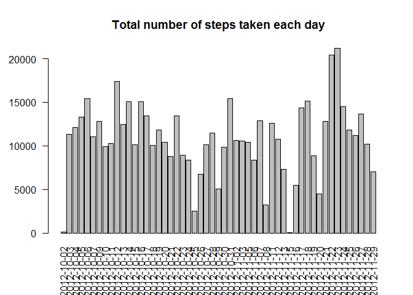
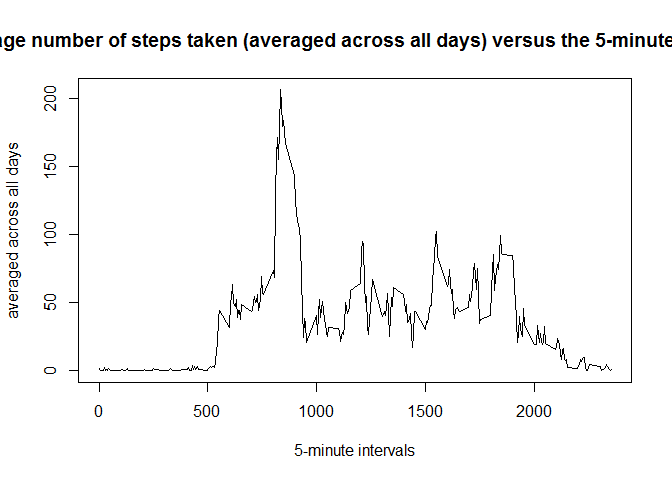
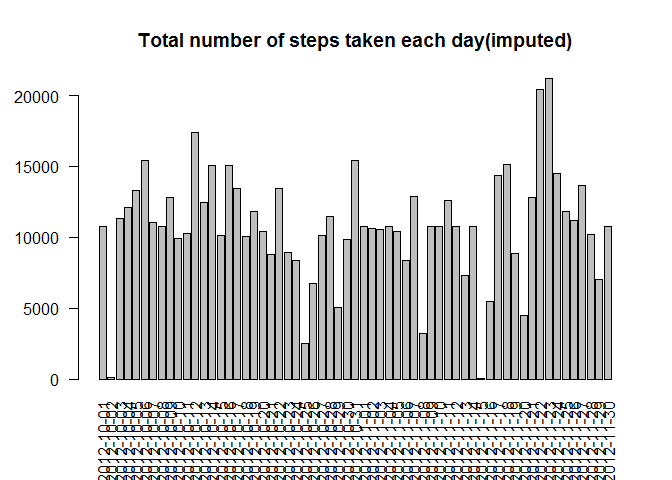
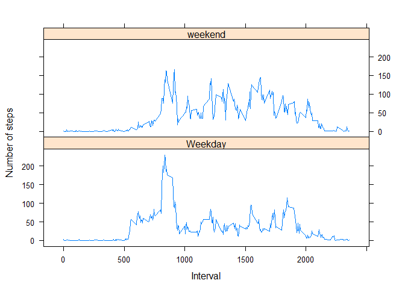

# Reproducible Research: Peer Assessment 1


## Loading and preprocessing the data


```r
# read the raw data into data frame objec rawData
rawData <- read.csv(unz("activity.zip", "activity.csv"))
# filter out NAs
filteredData <- rawData[complete.cases(rawData),]
# Aggregate steps, sum by date and store in q1HistoData
q1HistoData <- aggregate(filteredData$steps, by=list(Date=filteredData$date), FUN=sum)
Q2Data <- aggregate(filteredData$steps, by=list(Interval=filteredData$interval), FUN=mean)
```


## What is mean total number of steps taken per day?

Below is the histogram for sum of steps by Date

 

Mean - total number of steps taken per day : 

```r
paste('Mean - total number of steps taken per day : ', mean(q1HistoData$x))
```

```
## [1] "Mean - total number of steps taken per day :  10766.1886792453"
```

Median - total number of steps taken per day: 

```r
paste('Median - total number of steps taken per day : ', median(q1HistoData$x))
```

```
## [1] "Median - total number of steps taken per day :  10765"
```


## What is the average daily activity pattern?


```r
plot(Q2Data, type = 'l', main = 'Average number of steps taken (averaged across all days) versus the 5-minute intervals', xlab='5-minute intervals', ylab='averaged across all days')
```

 

Below is the calculation that work out the 5-minute interval that, on average, contains the maximum number of steps:

In 5-minute interval

```r
paste('Maximum steps interval = ', Q2Data[Q2Data$x == max(Q2Data$x), "Interval"])
```

```
## [1] "Maximum steps interval =  835"
```

In equivalent time in the day:

```r
maxMinuteInt <- Q2Data[Q2Data$x == max(Q2Data$x), "Interval"]
paste('Maximum stpes interval in Time = ', maxMinuteInt %/% 60, ':' , maxMinuteInt %% 60)
```

```
## [1] "Maximum stpes interval in Time =  13 : 55"
```


## Imputing missing values

### 1. The total number of missing values in the dataset (i.e. the total number of rows with NAs)

```r
sum(is.na(rawData$steps))
```

```
## [1] 2304
```

### 2. Devise a strategy for filling in all of the missing values in the dataset.

The strategy I am using is create a dataframe with the average number of steps taken per 5 minute interval.

Then I use this average and fill the NAs.

### 3. Create a new dataset that is equal to the original dataset but with the missing data filled in.
The new dataset is called dataImputeMeanOrdered:

```r
library(plyr)
impute.mean <- function(x) replace(x, is.na(x), mean(x, na.rm = TRUE))
dataImputeMean <- ddply(rawData, ~ interval, transform, steps = impute.mean(steps))
dataImputeMeanOrdered <- dataImputeMean[order(dataImputeMean$date,dataImputeMean$interval), ]

q3HistoData <- aggregate(dataImputeMeanOrdered$steps, by=list(Date=dataImputeMeanOrdered$date), FUN=sum)
```

#### 4.1 Make a histogram of the total number of steps taken each day

```r
barplot(q3HistoData$x, names.arg=q3HistoData$Date, las=2, main = "Total number of steps taken each day(imputed)")
```

 

#### 4.2  Calculate and report the mean and median total number of steps taken per day (Imputed)
Mean - total number of steps taken per day (Imputed): 

```r
paste('Mean - total number of steps taken per day (Imputed): ', mean(q3HistoData$x))
```

```
## [1] "Mean - total number of steps taken per day (Imputed):  10766.1886792453"
```

Median - total number of steps taken per day (Imputed): 

```r
paste('Median - total number of steps taken per day (Imputed): ', median(q3HistoData$x))
```

```
## [1] "Median - total number of steps taken per day (Imputed):  10766.1886792453"
```

*Do these values differ from the estimates from the first part of the assignment? What is the impact of imputing missing data on the estimates of the total daily number of steps?*
 
The mean didnt change but the median changed slightly (from an integer to the mean).
This is because the NAs has been filled with mean, which before are all integers, but now contains decimals (which is the mean).


## Are there differences in activity patterns between weekdays and weekends?

```r
# function to convert to weekday or weekend
convertToWDE <- function(x) if (weekdays(as.Date(x)) %in% c('Saturday','Sunday'))  {'weekend'} else {'Weekday' }
# add a column to dataframe to show whether the date is weekend or not
dataImputeMeanOrdered$dayType <- apply(dataImputeMeanOrdered[2],1,convertToWDE)
# aggregate data into mean number of steps vs interval + weekday/weekend
q4PlotData <- aggregate( steps ~ interval + dayType , dataImputeMeanOrdered , mean )

#plot the graph
library(lattice)
xyplot(q4PlotData$steps ~ q4PlotData$interval | q4PlotData$dayType, layout = c(1, 2), type = "l", xlab = "Interval", ylab = "Number of steps")
```

 


It seems for this individual he moves much more between 1300-1400 on a weekday.  But he movement is more spread out over the weekend.
